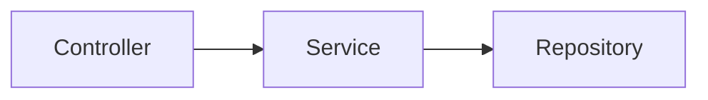

# Seschat Learning Roadmap
*A project to learn AI Engineering by building an AI-powered software engineering assistant.*

---

# Overall Goal

Instead of trying to build this:

```text
Huge AI Assistant
```

build this:

```text
Tiny useful tool
      ↓
Slightly smarter tool
      ↓
Repository analyzer
      ↓
Repository-aware AI
      ↓
Verified AI assistant
```

Every stage should leave you with something you could demo.

The goal is **not just to finish the project**, but to learn the engineering concepts behind modern AI systems.

---

# Stage 0 — Learn the Tools (2–3 days)

## Goal

Before writing any real code, become comfortable with the technologies you'll use.

Learn just enough to start building.

## Learn

- Python virtual environments
- pip
- Project structure
- Typer CLI
- pathlib
- subprocess
- SQLite basics
- pytest
- Git

Don't try to master everything.

You only need enough knowledge to comfortably use them.

## Reading

### Python

- Official Python Tutorial
- Real Python articles

### CLI

- Typer Documentation

### Testing

- pytest Documentation

### Database

- SQLite Tutorial
- SQLBolt

---

# Stage 1 — Build a Repository Scanner

## Goal

Create your first working developer tool.

Command:

```bash
seschat index ./my_project
```

Output:

```text
Found

42 Python files

13 C++ files

2 Markdown files

Ignored

node_modules

.git

build

venv
```

That's it.

No AI.

No LLM.

Just scanning files.

## Concepts You'll Learn

- Filesystem traversal
- pathlib
- os.walk()
- Ignore patterns
- CLI applications
- Basic software architecture

## Reading

- Python pathlib
- os.walk
- glob
- Typer Documentation

## Deliverable

A working command:

```bash
seschat index
```

This already feels like a real developer tool.

---

# Stage 2 — Extract Repository Metadata

## Goal

Instead of only listing files, understand what's inside them.

Example:

```cpp
class Cache

void insert()

void lookup()

#include <unordered_map>
```

Extract:

- File name
- Language
- Classes
- Functions
- Imports
- Comments

Do **not** use AI.

Use parsing.

## Concepts You'll Learn

- Abstract Syntax Trees (AST)
- Parsing
- Why regex is insufficient
- Tree-sitter

## Reading

- "What is an AST?"
- Tree-sitter Documentation
- Tree-sitter Playground

## Deliverable

Running:

```bash
seschat index
```

creates metadata for every source file.

---

# Stage 3 — Store Everything

## Goal

Instead of printing metadata, save it.

Use SQLite.

Example tables:

```text
files

functions

classes

imports
```

Now you can query the repository.

Example:

```sql
SELECT *

FROM functions

WHERE file = "cache.cpp";
```

## Concepts You'll Learn

- SQL
- SQLite
- Database schema design
- Normalization
- ORMs vs raw SQL

## Reading

- SQLBolt
- SQLite Documentation

## Deliverable

A searchable repository database.

---

# Stage 4 — Repository Search (Without AI)

## Goal

Support simple questions using keyword search.

Example:

```text
Where is Cache implemented?
```

Search through:

- filenames
- classes
- functions
- comments

Return:

```text
cache.cpp

cache.h

Cache::insert()

Cache::lookup()
```

No AI involved.

## Concepts You'll Learn

- Information Retrieval
- Keyword search
- Ranking
- TF-IDF
- Inverted indexes

## Reading

- Introduction to Information Retrieval (selected chapters)
- TF-IDF tutorials
- Inverted Index articles

## Deliverable

A repository search engine.

Already useful.

---

# Stage 5 — Add Your First LLM

## Goal

Introduce AI.

Pipeline:

```text
Question

↓

Search repository

↓

Collect relevant files

↓

Construct prompt

↓

LLM

↓

Answer
```

Notice:

The LLM doesn't search.

**Your software searches.**

This is one of the biggest mindset shifts in AI engineering.

## Concepts You'll Learn

- Prompt engineering
- Context windows
- Token limits
- OpenAI API
- Anthropic API
- Streaming responses

## Reading

- OpenAI API Documentation
- Prompt Engineering Guide

## Deliverable

```bash
seschat ask

"Where is authentication?"
```

works on your repository.

---

# Stage 6 — Learn Embeddings

## Goal

Replace keyword search with semantic search.

Instead of matching words:

```text
authentication
```

retrieve related concepts:

```text
JWTManager

OAuthHandler

LoginController
```

even if the word "authentication" never appears.

## Concepts You'll Learn

- Embeddings
- Vectors
- Cosine similarity
- FAISS
- Semantic search

## Reading

- OpenAI Embeddings Guide
- Sentence Transformers
- FAISS Documentation

## Deliverable

Semantic repository search.

This is where the project starts to feel truly AI-powered.

---

# Stage 7 — Build a Real RAG Pipeline

## Goal

Build Retrieval-Augmented Generation.

Pipeline:

```text
Question

↓

Embedding

↓

Vector Search

↓

Relevant Chunks

↓

Prompt Builder

↓

LLM

↓

Answer
```

## Concepts You'll Learn

- RAG
- Chunking
- Retrieval
- Ranking
- Hallucinations
- Context construction

## Reading

- Introductory RAG articles
- LangChain RAG Concepts
- LlamaIndex Documentation

## Deliverable

Repository-aware question answering.

---

# Stage 8 — Explain Code

## Goal

Support:

```bash
seschat explain cache.cpp
```

Pipeline:

```text
Read File

↓

Retrieve Metadata

↓

Prompt Builder

↓

LLM

↓

Summary
```

Generate:

- Summary
- Responsibilities
- Important classes
- Dependencies
- Suggestions

## Concepts You'll Learn

- Prompt templates
- Context engineering
- Prompt versioning

## Deliverable

AI documentation assistant.

---

# Stage 9 — Compiler Error Assistant

## Goal

Capture compiler or test failures and explain them.

Example:

```bash
pytest
```

or

```bash
make
```

Capture stderr.

Pipeline:

```text
Compiler Output

+

Relevant Code

↓

LLM

↓

Explanation

↓

Suggested Fixes
```

## Concepts You'll Learn

- subprocess
- stderr
- Exit codes
- Compiler diagnostics

## Reading

- Python subprocess Documentation
- GCC/Clang error messages

## Deliverable

AI debugging helper.

---

# Stage 10 — Test Generation

## Goal

Generate tests **and verify them**.

Pipeline:

```text
LLM

↓

Generate Tests

↓

Run pytest

↓

Capture Failures

↓

Regenerate

↓

Repeat
```

Now you're building an AI workflow rather than just calling an API.

## Concepts You'll Learn

- Agent loops
- Verification
- Retry strategies
- Structured outputs
- Pydantic

## Reading

- ReAct Paper
- OpenAI Structured Outputs
- Pydantic Documentation

## Deliverable

AI-generated tests that are automatically validated.

---

# Stage 11 — Pull Request Assistant

## Goal

Generate useful PR summaries.

Input:

```bash
git diff
```

Generate:

- Title
- Summary
- Risks
- Breaking changes
- Suggested reviewers

## Concepts You'll Learn

- Git internals
- Diff formats
- Prompt design

## Reading

- git diff Documentation

## Deliverable

AI code review assistant.

---

# Stage 12 — Architecture Generator

## Goal

Use repository metadata to generate diagrams.

Generate:

- Mermaid diagrams
- Dependency graphs
- Module relationships
- Class diagrams

Example:



## Concepts You'll Learn

- Dependency graphs
- Graph traversal
- Mermaid syntax

## Deliverable

Automatic architecture documentation.

---

# Stage 13 — Polish the Project

## Goal

Make the project feel production-ready.

Improve:

- Incremental indexing
- Configuration files
- Logging
- Progress bars
- Better error messages
- Embedding cache
- LLM response cache
- Docker support
- GitHub Actions
- Comprehensive testing
- Better README
- Demo GIF

These improvements demonstrate engineering maturity.

---

# Stage 14 (Optional) — Build a GUI

## Goal

Everything so far has been a CLI. That's deliberate — a terminal is the
fastest way to build and test each stage without fighting a UI layer at
the same time.

But a CLI isn't the only reasonable shape for this tool, and by this
point Seschat already has a clean separation between:

```text
scanner.py / metadata.py / db.py / search.py / ask.py / llm.py
        (the actual engine — no CLI-specific code in any of it)

cli.py
        (a thin presentation layer on top of the engine)
```

That separation is what makes a GUI *optional but realistic*, not a
rewrite. `cli.py` is the only file that has ever known Typer exists —
none of the engine modules import it or depend on it.

## Two directions, pick one (or both, later)

**A local desktop/web GUI** — e.g. a small FastAPI or Flask backend
wrapping the same `scan_repository()` / `search_repository()` /
`ask_repository()` calls `cli.py` already makes, with a simple web
frontend (or a desktop shell like Tauri/Electron) on top. This turns
`seschat index`, `seschat query`, and `seschat ask` into buttons/forms
instead of commands, and can render things a terminal can't — a file
tree, syntax-highlighted source excerpts, a chat-style history for
`ask`.

**A TUI (terminal UI)** — a middle ground using something like
Textual: still runs in a terminal, no web server needed, but
interactive — browsable file/match lists, scrollable `ask`
conversations, live index progress, without leaving the command line.

## Concepts You'll Learn

- Separating an "engine" from its interface (already mostly true by
  Stage 5 — this stage is really about *proving* it)
- Basic web backend design (routes, request/response shapes) if going
  the web/desktop route, or event-driven TUI design if going the
  Textual route
- State management for a long-lived process (a GUI doesn't exit after
  one command the way the CLI does — it needs to hold an open DB
  connection, track "which repo is currently loaded", etc.)
- Streaming partial output to a UI (this pairs naturally with the
  "Streaming responses" concept flagged back in Stage 5, which the CLI
  version never needed)

## Reading

- FastAPI Documentation (if web/desktop)
- Textual Documentation (if TUI)
- Tauri Documentation (if wrapping a web frontend as a desktop app)

## Deliverable

The same three capabilities (`index`, `query`, `ask`) available through
a GUI, backed by the exact same `seschat/` engine modules — `cli.py`
keeps working unmodified alongside it, since neither interface owns the
underlying logic.

## Why this is listed as optional, not required

The core learning goals of Seschat (parsing, databases, retrieval,
prompt construction, RAG, agent loops) are all interface-independent —
they're fully covered by Stages 1–13 without ever needing a GUI. This
stage exists for two reasons: it's a natural "portfolio polish" step
(a GUI demos better than a terminal), and it's a good forcing function
to confirm the CLI-vs-engine separation held up as intended. Pick this
up whenever the CLI starts feeling like a real product worth shipping,
not before.

---

# Recommended Learning Resources

## Python & Software Engineering

- Official Python Tutorial
- Real Python
- *Automate the Boring Stuff with Python*
- *Fluent Python* (later)
- *Architecture Patterns with Python*

---

## Databases

- SQLBolt
- SQLite Documentation

---

## Parsing & Compilers

- Tree-sitter Documentation
- Tree-sitter Playground
- *Crafting Interpreters* (selected chapters)

---

## Information Retrieval

- *Introduction to Information Retrieval* (Manning et al.)
- FAISS Documentation

---

## AI Engineering

- OpenAI API Documentation
- OpenAI Embeddings Guide
- *Build a Large Language Model (From Scratch)* by Sebastian Raschka
- RAG tutorials
- ReAct paper

---

## Tooling

- Git Documentation
- Docker Documentation
- GitHub Actions Documentation

---

# Suggested Timeline (12 Weeks)

| Week | Goal | Main Learning |
|------|------|---------------|
| 1 | CLI + Repository Scanner | Python tooling, filesystem traversal |
| 2 | Metadata Extraction | Parsing, ASTs |
| 3 | SQLite Index | Databases, schema design |
| 4 | Keyword Search | Information retrieval |
| 5 | First LLM Integration | Prompting, APIs |
| 6 | Embeddings | Vector search, FAISS |
| 7 | Full RAG Pipeline | Retrieval orchestration |
| 8 | Code Explanation | Prompt engineering |
| 9 | Compiler Error Assistant | subprocess, diagnostics |
| 10 | Test Generation | Verification loops |
| 11 | PR Assistant + Architecture Diagrams | Git, documentation |
| 12 | Polish, CI, Docker, README | Production engineering |

(Stage 14, the optional GUI, isn't in this 12-week timeline by design —
it's a follow-on to pick up after Stage 13 if/when it feels worth it,
not a fixed-schedule deliverable.)

---

# Philosophy Behind the Project

The temptation will be to jump straight to "the AI part."

Don't.

The AI call itself will probably be around **20 lines of code**.

The rest of the project—the part that interviewers care about—is everything surrounding the model:

- Repository parsing
- Static analysis
- Indexing
- Databases
- Retrieval
- Prompt construction
- Validation
- Testing
- Caching
- Software architecture

The real lesson of Seschat is that **AI Engineering is mostly software engineering**.

By the time you finish this roadmap, you'll have:

- A substantial portfolio project
- Practical experience with AI systems
- A much stronger understanding of modern software engineering
- Plenty of material to discuss in interviews, from architecture decisions to implementation trade-offs

Most importantly, you'll have learned **why** each component exists—not just how to connect APIs together.
